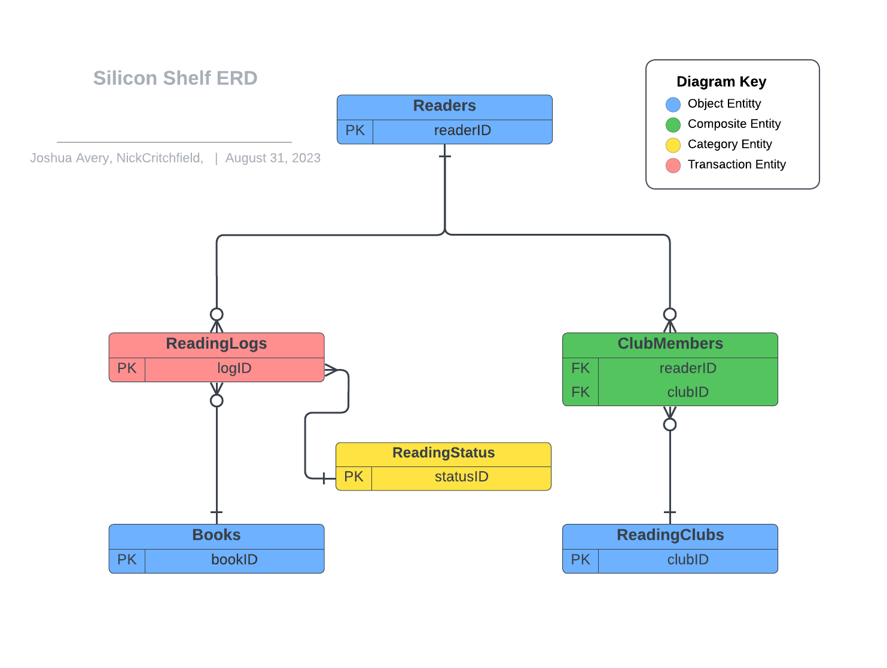
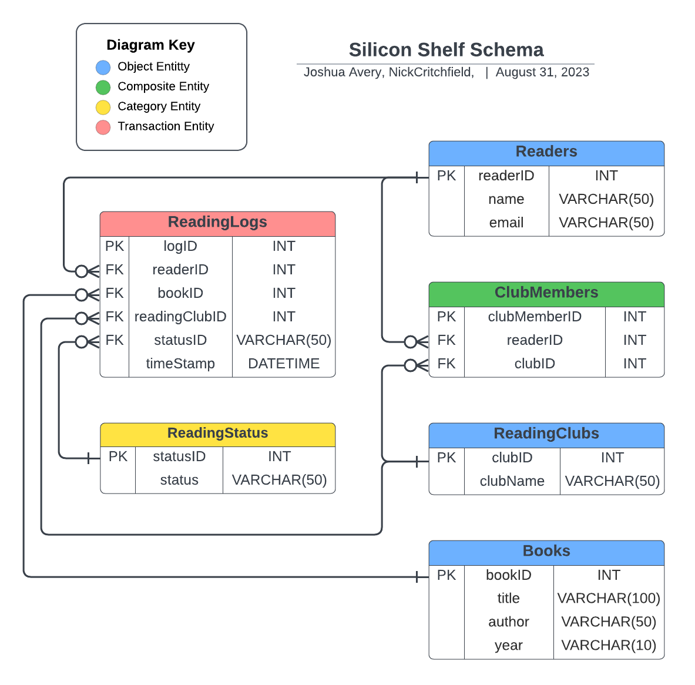

# OVERVIEW

Silicon Shelf is a platform for tracking personal reading lists as well as coordinating reading with friends via reading clubs. A single user can add books to their own log, manage their reading list with status updates, track dates which they started and completed each book. Users may create and join reading clubs. This allows them to add a book to all their club members’ reading logs. With an anticipated 10,000 monthly active users and an average yearly enqueue rate of 10 books per user, a robust relational database is needed.

# DATABASE OUTLINE

* Readers (Object Entity)
  * readerID: INT, AUTO_INCREMENT, NOT NULL, PK
  *	name: VARCHAR(50), NOT NULL
  * email: VARCHAR(50), NOT NULL
  *	relations:
    * M:M Books through ReadingLogs
	* M:M ReadingClubs through ClubMembers

* Books (Object Entity)
  * bookID: INT, AUTO_INCREMENT, NOT NULL, PK
  * title: VARCHAR(50), NOT NULL
  * author: VARCHAR(50), NOT NULL
  * year: VARCHAR(10)
  * relations:
    * M:M Readers through ReadingLog
    * M:M ReadingClubs through ReadingLog

* ReadingClubs (Object Entity) 
  * clubID: INT, AUTO_INCREMENT, NOT NULL, PK
  * clubName: VARCHAR(50), NOT NULL
  * relations:
    * M:M Readers through ClubMembers
    * M:M Books through ClubMembers

* ReadingLogs (Transaction Entity) 
  * logID: INT, AUTO_INCREMENT, NOT NULL, PK
  * readerID: FK(Readers.readerID), ON DELETE SET NULL
  * bookID: FK(Books.bookID), ON DELETE SET NULL
  * readingClubID: FK (ReadingClubs.clubID), DEFAULT NULL, ON DELETE SET NULL
  * statusID: FK (ReadingStatus.status), ON DELETE SET NULL
  * timeStamp: DATETIME, DEFAULT, (CURRENT_TIMESTAMP)
  * relations:
    * 1:M Readers
    * 1:M Books
    * 1:M ReadingClubs
    * 1:M ReadingStatus

* ClubMembers (Composite Entity) 
  * clubMemberID: INT, NOT NULL, AUTO _INCREMENT, PK
  * readerID: FK(Readers.readerID), NOT NULL, ON DELETE CASCADE
  * clubID: FK(ReadingClubs.clubID), NOT NULL, ON DELETE CASCADE
  * relations:
    * M:1 Readers
    * M:1 ReadingClubs

* ReadingStatus (Category Entity) 
  * status: INT, NOT NULL, AUTO_INCREMENT PK
  * status: VARCHAR(50), NOT NULL

# ENTITY-RELATIONSHIP DIAGRAM

# SCHEMA

# ORIGINAL CODE HIGHLIGHTS

We want to highlight original code used in the following files:

* DOM manipulation and event handling in: books.js, clubmembers.js, reader.js, readingclubs.js, readinglogs.js, readingstatus.js
* app.css
* books.html, clubmembers.html, readers.html, readinglcubs.html, readinglogs.html, readingstatus.html

# CODE CITATION:

Adaptations of the following source were used for:
* CRUD routes in app.js
* route callers for CRUD operations in books.js, clubmembers.js, readers.js, readingclubs.js, readinglogs.js, readingstatus.js
* db-connect.js

AUTHORS: George Kochera, Micheal Curry, GitHub user Cortona1, GitHub user dmgs11
DATE(S) RETRIEVED: April - June, 2023
TITLE: Node Starter App
TYPE: coding guide
URL: [Node Starter App](https://github.com/osu-cs340-ecampus/nodejs-starter-app)
